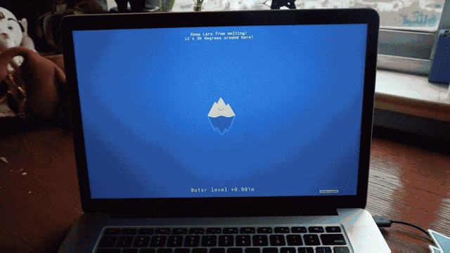
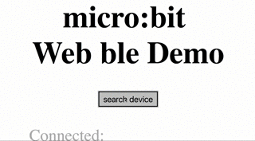

# microBit.js
A javascript library to interact with [BBC micro:bit](http://microbit.org/) using web bluetooth API.


## Usage

To use the library, download and upload [this firmware](https://drive.google.com/uc?id=0B2Ud_NaMFsQSdm1BMVMtN3F4a3c&export=download) on your BBC micro:bit board.

The firmware was produced by [bittysoftware](http://www.bittysoftware.com/downloads.html).

Keep in mind that web bluetooth API are still experimental and your OS and browser might not support the feature. Read more about this [here](https://developers.google.com/web/updates/2015/07/interact-with-ble-devices-on-the-web).

This Library allows you to read and write the values of all the BLEcharacteristic exposed by the microBit board using simplified API's.

For more info about all micro:bit ble services please refer to the [official documentation](https://lancaster-university.github.io/microbit-docs/ble/profile/).

The example folder provided contains several examples for interacting with the device.

## Constructor

- `microBit=new uBit()`

## Properties

- `microBit.connected`

## Functions


- `microBit.searchDevice()`

  Search for ble devices in range.


- `microBit.setButtonACallback(callbackFunction)`

  Register a callback function to be invoked when Button A is pressed.

  example:
  ```
  microBit.setButtonACallback(function(){
    console.log("buttonA pressed");
  });
  ```

- `microBit.setButtonBCallback(callbackFunction)`

  Register a callback function to be invoked when Button B is pressed.

  example:
  ```
  microBit.setButtonBCallback(function(){
    console.log("buttonB pressed");
  });
  ```

- `microBit.onConnect(callbackFunction)`

  Register a callback function invoked when the microBit connects

  example:
  ```
  microBit.onConnect(function(){
    console.log("connected");
  });
  ```

- `microBit.onDisconnect(callbackFunction)`

  Register a callback function invoked when the microBit disconnects

  example:
  ```
  microBit.onDisconnect(function(){
    console.log("disconnected");
  });
  ```

- `microBit.onBleNotify(callbackFunction)`

  Register a callback function invoked every time the value of characteristic changes and it is notified by the device.

  example:
  ```
  microBit.onBleNotify(function(){
    document.getElementById("buttonA").innerHTML=microBit.getButtonA();
  }
  ```

- `microBit.writeMatrixIcon(icon)`

  Updates the led matrix on the microbit.
  The `icon` passed to the function must be 5x5 matrix.
  0=led off;
  1=led on;

  example:
  ```
  var ledMatrix = [
    ['0', '0', '0', '0', '0'],
    ['0', '1', '0', '1', '0'],
    ['0', '0', '0', '0', '0'],
    ['1', '0', '0', '0', '1'],
    ['0', '1', '1', '1', '0']
  ]

  microBit.writeMatrixIcon(ledMatrix);

  ```

- `microBit.writeMatrixText(text)`

  Updates the led matrix of the microbit with a scrolling text.

  example:
  ```
  microBit.writeMatrixText("ciao microBit")
  ```

- `writeMatrixTextSpeed(speed)`

  set the speed of the scrolling text on the matrix
  example:
  ```
  microBit.writeMatrixTextSpeed(10)
  ```

- `microBit.getAccelerometer()`

  Returns the value of the accelerometer as a object.

  example:
  ```
  acceleration=microBit.getAccelerometer();
  acc_x=acceleration.x;
  acc_y=acceleration.y;
  acc_z=acceleration.z;

  ```

- `microBit.getTemperature()`

  Returns the value of the temperature measured on the processor in celsius.

  example:
  ```
  temperature=microBit.getTemperature();

  ```


- `microBit.getBearing()`

  Returns the value of magnetometer bearing from 0 to 360.
  0= pointing nord

  example:
  ```
  bearing=microBit.getBearing();

  ```

## Examples
Check the examples folder for working examples.

### Basic example
Connect your microbit to a webpage, visualize the data and change the animations on the led matrix.

[Try it here](https://antefact.github.io/microBit.js/examples/basic/)




### basic p5.js example
Learn how to interact with the microbit from a [p5.js](https://p5js.org/) sketch, rotate a cube on the canva reading the accelerometer.

[Try it here](https://antefact.github.io/microBit.js/examples/p5js_example/)

### Lars the iceberg
Use the microBit to control Lars the iceberg. Don't let it melt!
Developed using [p5.js](https://p5js.org/) and [p5.play](http://p5play.molleindustria.org/) library.

[Try it here](https://antefact.github.io/microBit.js/examples/p5play_Lars_example/)
